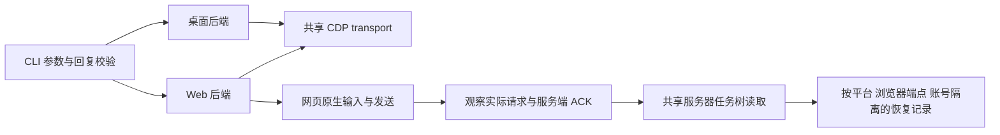

# Doubao Web 平台设计

目标：保留 Doubao Work 与普通豆包桌面的现有行为，增加 doubao.com 的普通对话和云端工作任务。网页使用浏览器中已登录的账号；不导出凭据，不自动切换账号或平台。

## 调研结论

2026-10-07 检查了当前代码、实际网页和网页公开构建资源。

- 默认客户端：安装 `/Applications/DoubaoWork.app` 时选择 Work，否则选择 Doubao。`DOUBAO_APP` 可覆盖自动识别，显式选择优先；连接或登录失败不触发回退。
- 实际登录网页存在工作账号、项目、企业知识和“云电脑”运行时。不能把 Web 一概视为只支持普通聊天。
- Web 的 aid 为 `497858`；普通对话 `agent_mode=2 / mode_id=1`，工作任务 `agent_mode=1 / mode_id=3`。桌面 CLI 原本发送工作任务，直接复用其发送请求会改变普通聊天的含义。
- 网页普通模式与工作模式有独立模型配置。例如同名 Turbo 的 key 分别为 `3` 和 `4`。首期使用网页原生模型配置，不接受桌面模型别名或 reasoning 参数。
- 网页运行时服务只允许选择 cloud；非 cloud 请求被拒绝或交给客户端。浏览器不能直接替代桌面的本地 MCP、工作目录、skills 和权限策略。
- 工作任务终止服务公开契约为 `POST /alice/generaltask/terminate`，请求体 `{thread_id}`。必须读回服务器任务树才能确认停止。
- Chrome 136 起不能对默认用户数据目录开启远程调试，必须使用独立目录。首次 Web 启动需要在该专用浏览器中登录；日常 Chrome 中的登录不会被复制。

来源：[实际网页](https://www.doubao.com/chat/)、[工作任务服务](https://lf-flow-web-cdn.doubao.com/obj/flow-doubao/doubao/chat/static/js/async/an.d68aa88f8e.js)、[Web 运行时服务](https://lf-flow-web-cdn.doubao.com/obj/flow-doubao/doubao/chat/static/js/async/s2-runtime-environment-service.073249b6ab.js)、[Chrome CDP 配置要求](https://developer.chrome.com/blog/remote-debugging-port)。网页构建资源和私有服务契约可能随版本改变，代码会拒绝无法确认的身份和状态。

## 接口与平台选择

```bash
doubao cdp launch                       # 已安装 Work 时仍默认 Work
doubao --platform work status --json
doubao --platform doubao status --json
doubao web login --timeout 120
doubao web status --json
doubao web --target <id> sessions list --json
doubao web sessions create "你好" --mode chat --wait --json
doubao web sessions create "整理一个三点计划" --mode work --runtime cloud --wait --json
doubao web sessions wait <conversation-id> --run <run-id> --json
doubao web sessions stop <conversation-id> --run <run-id> --json
```

`doubao web <command>` 是网页命令入口，单独运行 `doubao web` 显示 Web 帮助；`--platform web` 保留为兼容写法。Web 命名空间与桌面选择器冲突时在连接前拒绝。`--app work|doubao` 保留为桌面兼容入口。与 `--platform` 冲突时报错。默认不会自动选择 Web。端口分别为 Work `9226`、Doubao `9225`、Web `9227`。

命令命名空间与浏览器传输分开：当前内部保留 CDP，发送、登录身份、网页 SDK 请求处理与流观察依赖真实浏览器会话。纯 HTTP 后端需要另行验证登录续期和网页签名契约；本次未实现。Playwright 管理浏览器也是可选实现，但仍需浏览器会话及其独立 profile，且引入运行依赖；其 CDP 接入不会消除 CDP。参见 [Playwright 连接方式](https://playwright.dev/docs/api/class-browsertype#browser-type-connect-over-cdp)。

Web 只连接精确 HTTPS doubao.com chat 页面；多个匹配标签页必须传 `--target`。普通账号和工作账号可能暴露不同的创建入口；缺少对应入口时明确失败，不切换账号。`--mode` 用于创建新会话，后续发送继承会话实际模式。

`doubao web login` 管理浏览器启动和登录等待，用户无需先执行 `cdp launch`。已有有效账号与就绪输入框时立即返回；浏览器未启动时自动使用独立 Chrome 配置目录启动；已连接但无豆包标签页时新建一个 chat 标签页。未登录时显示浏览器窗口，用户自行完成扫码或验证码，CLI 只观察真实账号 ID 和 chat/work 输入框状态。默认共享 120 秒截止时间，覆盖发现、启动、连接和等待；超时返回 `login_timeout`、非零退出码和已知启动/目标状态，并保留浏览器窗口。多标签页或显式目标缺失时拒绝自动选择。旧 `web cdp status/launch` 保留为高级兼容入口。

## 实现边界



发送采用网页原生输入框，不自行拼装 Web completion、工作目录或 sandbox 参数。CDP 只观察匹配消息、会话和模式的原生请求，取得服务端 ACK 的真实 conversation/run/local-message ID。收到 ACK 后保存恢复记录；`--wait` 读取指定 run 的主回复与子任务，不能仅凭 DOM 静止或流结束认定完成。

恢复仅继续读取已有任务及异步流，Web 不进入桌面发送协议的 recovery 分支。超时和断开均不自动重发、不自动取消。身份、会话、run 或任务归属不匹配时返回错误；已接受请求的身份信息保留在结果中。

取消先定位指定 run，再请求停止主回复和已确认归属的子任务，最后重复读取服务器状态。请求成功但任务仍运行时返回 `stopped:false` 和非零退出码。已经结束的旧 run 不会影响新 run。

会话命令在开始时固定账号，发送准备阶段、提交后、任务 API 和恢复记录访问均检查账号变化。两个账号不能共用恢复记录。login 允许用户手动完成登录或选择账号，成功前不固定账号；CLI 不提交凭据、验证码、批准或任务的等待输入。

## 能力范围

| 能力 | Web 首期行为 |
| --- | --- |
| login | 自动启动或复用浏览器；等待用户完成网页登录；超时保留窗口 |
| status / capabilities / cdp | 报告连接、标签页、登录、账号及模式；独立 Chrome 启动 |
| sessions list / current / open | 当前账号的已渲染侧栏；显式打开指定会话 |
| sessions read | 服务器最近最多 100 条主会话消息；不承诺全量历史 |
| sessions create / send | 普通对话与云电脑工作；使用网页原生模型配置 |
| --wait / status / wait / --run | 指定已接受轮次；服务器任务树与最终回复校验 |
| stop | 对目标 run 发出停止并读取服务器任务树；只有服务器状态为 `cancelled` 才报告取消。`stopped: true` 只证明没有运行中或未知节点。 |
| --runtime cloud | Web 工作；普通对话不接受运行时参数 |
| 附件与模型切换 | 网站本身支持；CLI 首期未适配，参数在连接前拒绝 |
| 项目 / 企业知识参数 | 使用网页原生配置；CLI 首期不修改这些配置 |
| local / MCP / workspace / permission / skills | 不支持，连接前拒绝 |
| profiles | 不读取桌面配置目录；通过目标浏览器和原生账号选择 |

共享任务读取上限沿用现有保护：100 条主消息、100 个线程，每线程最多 20 页。达到限制而不能确认完整状态时，不能返回成功。

## 验收与证据边界

本地测试覆盖平台与目标选择、未登录/草稿/生成保护、不支持参数预检、可见编辑器与 hydration、原生请求及 ACK 绑定、SSE/UTF-8 解析、账号与恢复记录隔离、禁止 Web 重发、指定 run 恢复、取消状态及竞态；login 覆盖已登录立即返回、无标签页新建、自动启动、匿名超时保留窗口、首次 about:blank 过渡、外站拒绝及绝对截止。2026-10-07 focused Web UI tests 为 27/27；完整本地 suite 为 204/204（0 fail/skip）。`npm pack --dry-run` 确认包含 `src/web.mjs` 与 `src/web-stream.mjs`。

真实 E2E 已覆盖一个账号的 Work 模式和另一个账号的普通聊天模式，并非两个账号都测了两种模式。Work 的手动与新鲜生命周期覆盖空会话、创建、后续发送、schema、读取、等待、侧栏、状态、打开和 current；普通聊天初始矩阵为 13/13，路由修复后的完整消息生命周期再次通过。两种模式的创建与追加轮次均单独等待，并读回精确的合成回复。Work continuation runner 9/9 使用已接受的双轮合成会话补足其余检查。另一次普通聊天 route probe 捕获同源 local 路由转为真实会话路由，修复后创建命令正常返回。详细矩阵及负例见 [E2E 结果](web-e2e-results.md)。

真实停止证据需要区分聊天和 Work：普通聊天 run 被服务器确认 `cancelled`，旧 run 不会停止新 run，wait 超时不重发。Work 终止 endpoint 的请求体曾因 task ID 被编码为字符串而返回 HTTP 400；修复后抓到 HTTP 200 和未加引号的精确数字 ID。读回的 Work 任务树最终为 completed（最新 active-stop 一节点，历史独立记录两节点或三节点；没有证实三节点同时运行），没有节点报告 cancelled。因此这证明停止链路可读回终态，不证明 Work 子任务取消。

发送还修复了页面首次输入框更新延迟：`Input.insertText` 后首次读取 draft 可能仍为空，旧守卫会在点击 Send 前安全拒绝。现在在输入框暂不可用或 draft 仍为空时轮询，同时检查身份、模式、路由、附件与生成状态；非空但不匹配仍拒绝，且不会重复插入或重试发送。ACK 后新会话可能先位于同源 `/chat/local_<16 digits>`，随后转为 `/chat/<numeric-id>`。只在匹配 native ACK 后放行这段精确 same-origin 转场，初始 target、origin 和 UID 守卫保持严格；已 ACK 的 ID 保留，wait 可按同一 run 恢复。原生 API 参数在单次 evaluate 内前后校验 UID，参数轮询最多 3 秒且不超过 caller 剩余预算。账号中途切换的真实测试失败关闭并保留已知 ID；恢复身份后仍可查询原任务。

负例组 22/22 在连接 Web CDP/native fetch 前拒绝不支持功能、无效参数和命令；target、登录、草稿、生成、账号切换与恢复记录隔离用例通过。独立空 profile 的 CDP 启动在隔离端口成功，没有复制登录状态，只关闭了本次测试实例。更新检查和自动更新开关通过，但版本已是 latest，实际安装升级分支未触发。所有 live 消息均为合成内容。

网页异步恢复曾沿用桌面 API5 域名而出现 `Failed to fetch`。同一已接受任务的同源 `/chat/async/chunk_stream` 实测返回 HTTP 200 与 SSE；实际 adapter 将两条流序号从 0/0 恢复到 41/13，在 1.5 秒预算内用 395 ms 返回。等待 5 秒的真实任务按时返回 timeout 并保留 ID，随后独立 status 可恢复。停止截止收尾曾丢失 ID；修复后注入 1.5 秒网络延迟，stop 1 秒返回非零、`stopped:false` 和原 ID，没有发出取消请求，finally 恢复网络后读回完整终态。浏览器 HTTP、JSON 与流读取均使用绝对截止，不在到期后发新请求或推进 checkpoint；停止与身份错误保留已知结果。历史失败仍保留在私有证据中。

新增 login 的真实测试确认已登录账号可直接复用，匿名页面按 1 秒预算返回 login_timeout 且保留标签页；空 profile 在隔离端口自动启动，按 5 秒预算返回 login_timeout 且保留页面。只由测试 harness 关闭其创建的浏览器，原账号和草稿保持不变。新的真实凭据或验证码登录过程未执行；状态从匿名到已登录由受控测试验证。
